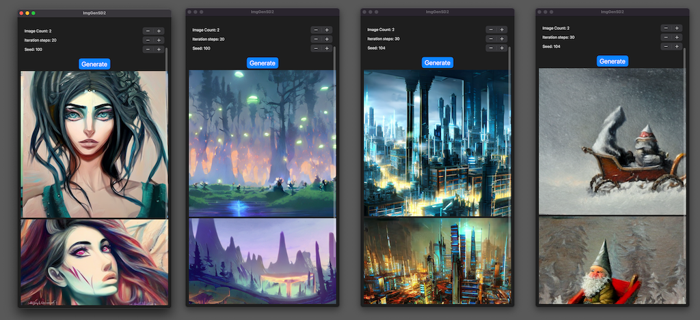
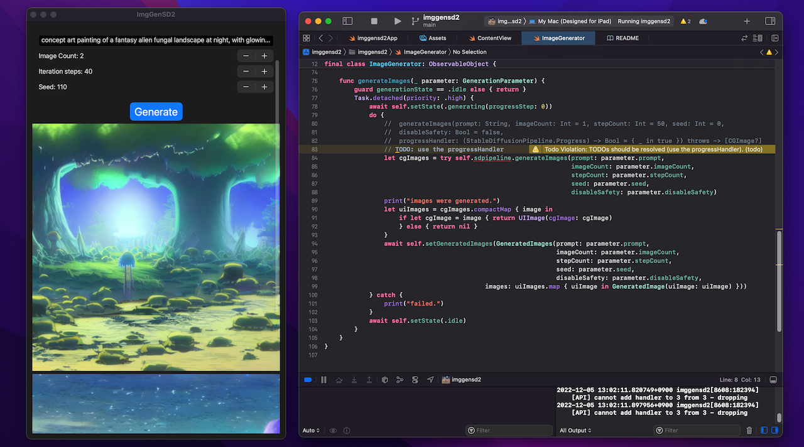
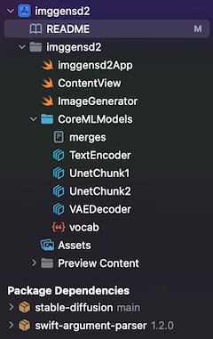
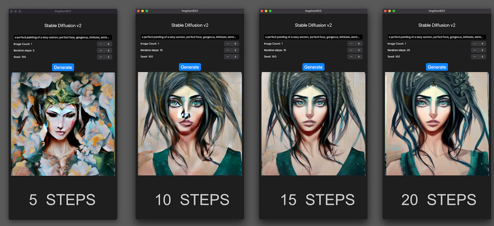
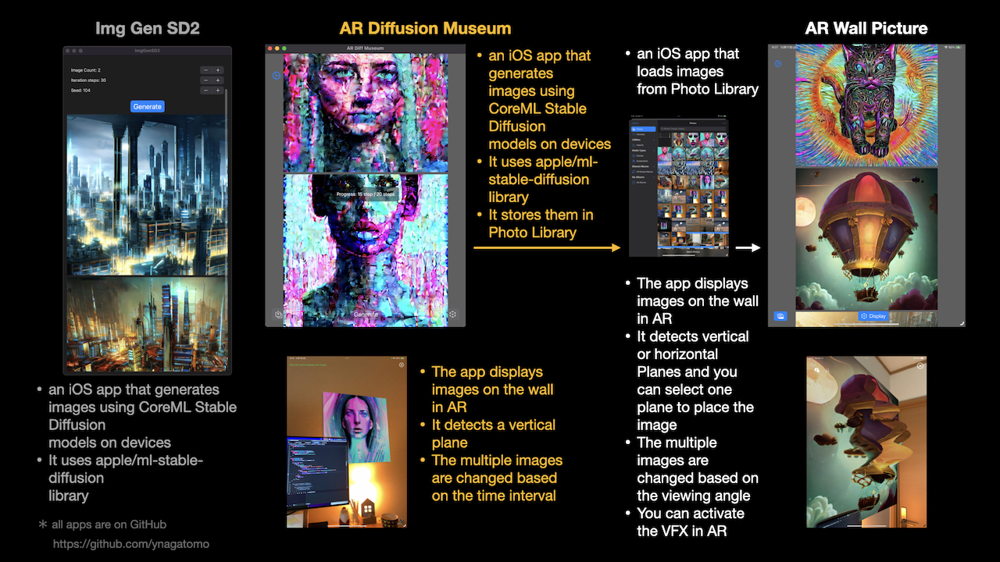

# Image Generator with Stable Diffusion v2


A minimal iOS app that generates images using Stable Diffusion v2.
You can create images specifying any prompt (text) such as "a photo of an astronaut riding a horse on mars".

- macOS 13.1 or newer, Xcode 14.2 or newer
- iPhone Pro 12+ / iOS 16.2 or newer, iPad Pro with M1/M2 / iPadOS 16.2 or newer

You can run the app on above mobile devices.
And you can run the app on Mac, building as a Designed for iPad app.

This Xcode project does not contain the CoreML models of Stable Diffusion v2 (SD2).
So you need to make them converting the PyTorch SD2 models using Apple converter tools.
(see below)

The project uses the Apple/ml-stable-diffusion Swift Package.
You can see how it works through the simple sample code.

- Apple/ml-stable-diffusion repo: https://github.com/apple/ml-stable-diffusion





## Change Log
- [1.2.2 (8)] - Jan 16, 2023 `[Changed]`
    - Commented out the specifying the MLModelConfiguration.computeUnits and changed it to use the default,
    because it is not necessary.
- [1.2.1 (7)] - Dec 30, 2022 `[Changed]`
    - Changed the Seed UI from Stepper to TextField and the initial value from 100 to 1_000_000.
- [1.2.0 (6)] - Dec 25, 2022 `[Added]`
    - Added the guidance scale. It requires the latest apple/ml-stable-diffusion Swift Package.
- [1.1.0 (5)] - Dec 21, 2022 `[Added]`
    - Added the negative prompt. It requires the latest apple/ml-stable-diffusion Swift Package.
- [1.0.3 (4)] - Dec 18, 2022 `[Changed]`
    - set `MLModelConfiguration.computeUnits` to `.cpuAndGPU`, when running on mobile devices.
- [1.0.2 (3)] - Dec 16, 2022 `[Changed]`
    - The apple/ml-stable-diffusion Swift Package v0.1.0 was released.
    - At apple/ml-stable-diffusion Swift Package v0.1.0, `reduceMemory` option of StableDiffusionPipeline(resourcesAt:)
    was added. And on iOS, the reduceMemory option should be set to true.
    - This option was added and set to true, in `ImageGenerator.swift` when creating StableDiffusionPipeline.
    - According to the new apple readme, iPhone requirement was changed to iPhone Pro 12+.
- [1.0.1 (2)] - Dec 8, 2022 `[Changed]`
    - Changed to delay creation of `StableDiffusionPipeline` until the first image 
    generation and execute it in a background task.
    - This eliminates the freeze when starting the app, but it takes time 
    to generate the first image.
    - Tested with Xcode 4.2 RC and macOS 13.1 RC.
    - With the release of Xcode 14.2 RC, the correct Target OS 16.2 was specified.

## Convert CoreML models

Convert the PyTorch SD2.1 model to CoreML models, following Apple's instructions.
(https://github.com/apple/ml-stable-diffusion)

```bash
# create a Python environment and install dependencies
% conda create -n coremlsd2_38 python=3.8 -y
% conda activate coremlsd2_38
% mkdir SD21ModelConvChunked
% cd SD21ModelConvChunked
% git clone https://github.com/apple/ml-stable-diffusion
% cd ml-stable-diffusion
pip install -e .
```

Visit the Hugging Face Hub - stabilityai/stable-diffusion-2-1-base model's page.
(https://huggingface.co/stabilityai/stable-diffusion-2-1-base)
Check the Terms and Use and accept it. Then you can use the model.

And you need a Hugging Face's `User Access Token`, to download huggingface/models.
Please visit Hugging Face's site and make an access token at Account Settings.

```bash
# cli login
% huggingface-cli login
Token:    # <- input your Access Token
```

Download and convert the SD2.1 PyTorch model to CoreML models.
If you do this on a Mac/8GB memory, please close all running apps except Terminal,
otherwise the converter will be killed due to memory issues.

Use these options:
- `--model-version stabilityai/stable-diffusion-2-base` ... model version
- `--bundle-resources-for-swift-cli` ... compile and output `mlmodelc` files into `<output-dir>/Resources` folder. The Swift Package uses them.
- `chunk-unet` ... split the Unet model into two chunks for iOS/iPadOS execution.
- `--attention-implementation SPLIT_EINSUM` ... use SPLIT_EINSUM for Apple Neural Engine(ANE).

```bash
python -m python_coreml_stable_diffusion.torch2coreml --convert-unet --convert-text-encoder --convert-vae-decoder --convert-safety-checker -o sd2CoremlChunked --model-version stabilityai/stable-diffusion-2-1-base --bundle-resources-for-swift-cli --chunk-unet --attention-implementation SPLIT_EINSUM --compute-unit CPU_AND_NE
```

How to add Core ML model files to Xcode project:

1. In Finder, make the directory, `CoreMLModels`, and put CoreML model files into the directory.
    - `merges.txt, vacab.json, UnetChunk2.mlmodelc, UnetChunk1.mlmodelc, VAEDecoder.mlmodelc, TextEncoder.mlmodelc`
    - when you make an app for only Mac, use the Unet.mlmodelc instead of UnetChunk1/2, which are for mobile devices.
1. Remove the `CoreMLModels` group in the Xcode Project Navigator.
1. Drag and drop the `CoreMLModels` directory in Finder into the Xcode Project Navigator, to add the files.
    - At `Choose options for adding these files` dialog, check the `[v] Copy items if needed` and `[v] Create folder references`, and `Add to targets: [v] imggensd2`




Now you can build the project, targeting to iPhone, iPad, or My Mac (Designed for iPad)

## Consideration

### Extended Virtual Address Space and Increased Memory Limit capabilities

- if you encounter the memory limit issues on mobile devices, please try adding `Increase Memory Limit` and `Extended Virtual Address Space` capabilities to your App ID. This adds an entitlement to your Xcode project.
- please make sure that you use the App ID which registered the capabilities, "Extended Virtual Address Space" and "Increased Memory Limit", at Developer - Identifiers site. Or Xcode displays the signing and capabilities errors.

### Progress handler

- if you would like to handle the progress handler during generating images,
please check the another repo, which shows a sample of progress-handler.
AR Diffusion Museum: https://github.com/ynagatomo/ARDiffMuseum

### Large binary file

- Since the model files are very large (about 2.5GB), it causes a large binary of the app.
- The FAQ of Apple documentation says "The recommended option is to prompt the user to download 
these assets upon first launch of the app. This keeps the app binary size independent of the 
Core ML models being deployed. Disclosing the size of the download to the user is extremely 
important as there could be data charges or storage impact that the user might not be comfortable with.".

### Step count

- Stable Diffusion v2 can generate good images with fewer steps than v1.4/v1.5.
- This means that the SD2's generation time is shorter.



### Diffusers models

- You can use diffusers/text-to-image models on [Hugging Face Hub](https://huggingface.co/models?pipeline_tag=text-to-image&sort=downloads) .
- Convert the model you want to use to CoreML models and add them to the Xcode project.
- For example, when you use the [852wa/8528-diffusion](https://huggingface.co/852wa/8528-diffusion) model,
which is a fine-tuning model of SD v1.4, convert the models with the below command.

```bash
% python -m python_coreml_stable_diffusion.torch2coreml --convert-unet --convert-text-encoder --convert-vae-decoder --convert-safety-checker -o sd2CoremlChunked --model-version 852wa/8528-diffusion --bundle-resources-for-swift-cli --chunk-unet --attention-implementation SPLIT_EINSUM --compute-unit CPU_AND_NE
```

## Related apps

- [AR Diffusion Museum](https://github.com/ynagatomo/ARDiffMuseum) : 
It shows how to use the progress handler and displays the generating images step by step.
- [AR Wall Picture](https://github.com/ynagatomo/ARWallPicture) : 
It's a sample app that uses generated images. It displays images in Photo Library on the wall with AR.



## References

- Apple Swift Package / ml-stable-diffusion: https://github.com/apple/ml-stable-diffusion
- Stable Diffusion with Core ML on Apple Silicon, Apple Dec 2022: https://machinelearning.apple.com/research/stable-diffusion-coreml-apple-silicon
- Deploying Transformers on the Apple Neural Engine, Apple June 2022: https://machinelearning.apple.com/research/neural-engine-transformers
- Hugging Face Hub - stabilityai/stable-diffusion-2: https://huggingface.co/stabilityai/stable-diffusion-2


